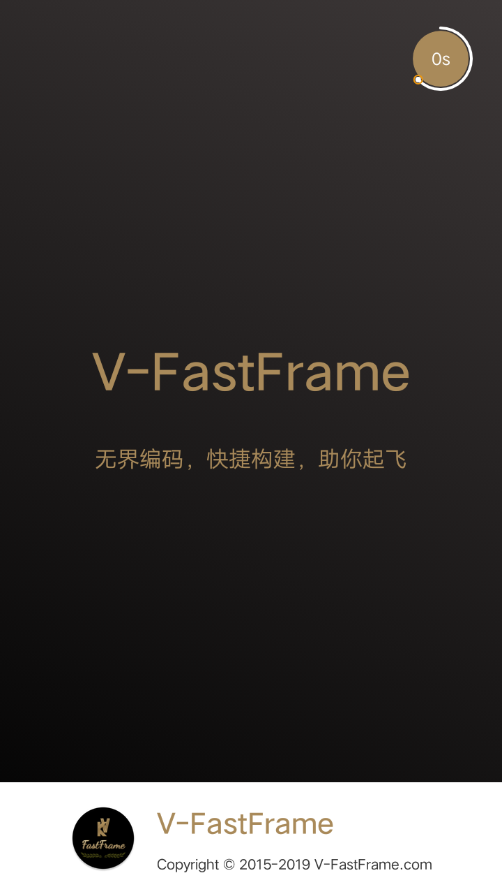
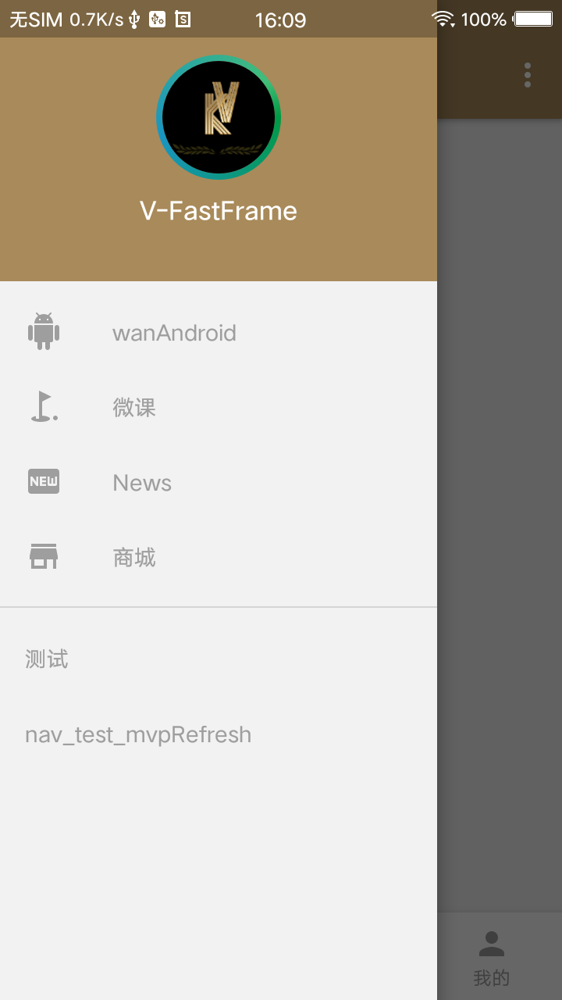
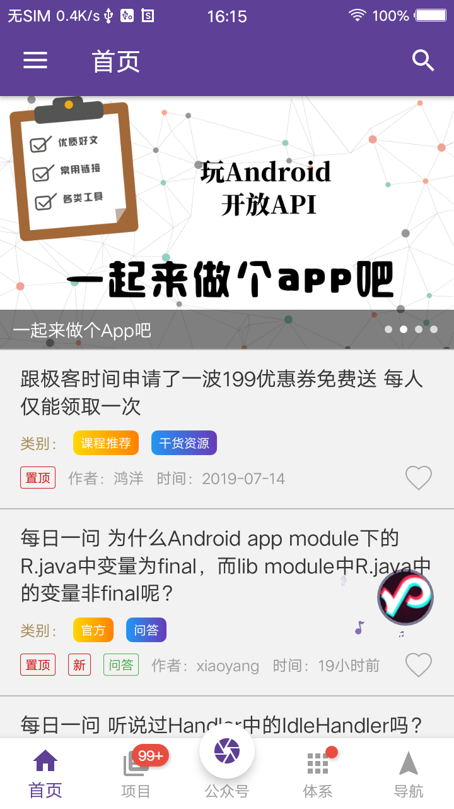
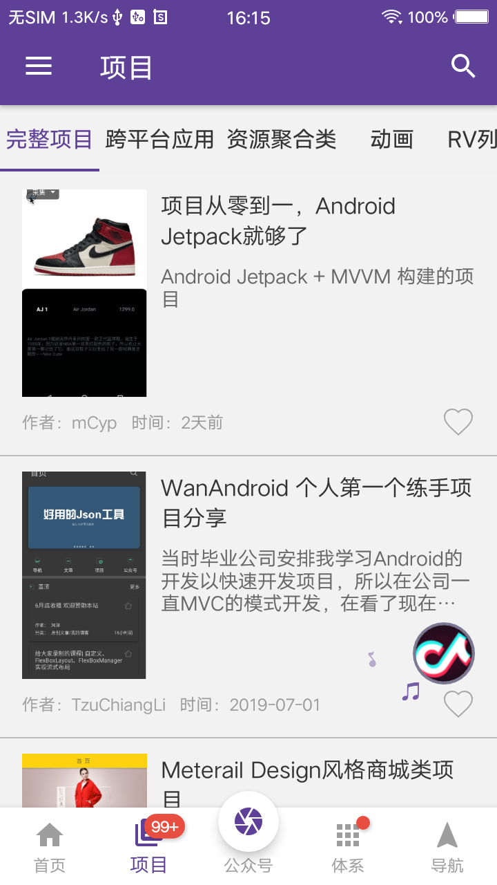
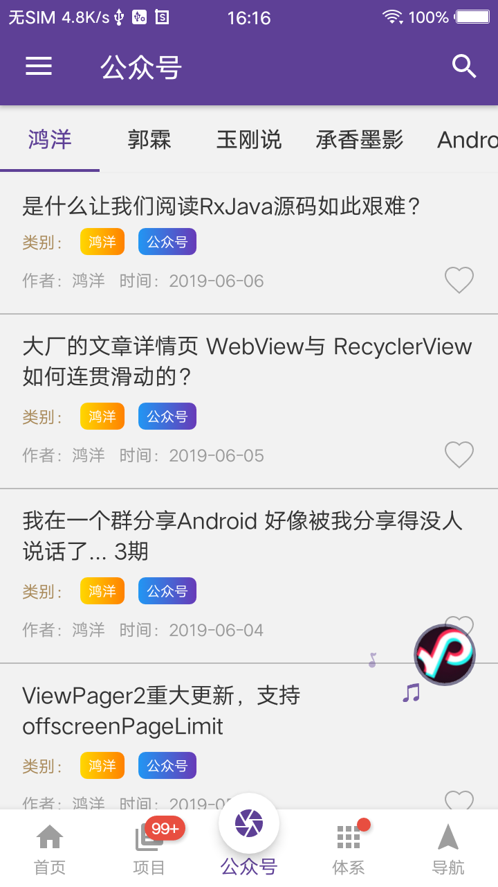
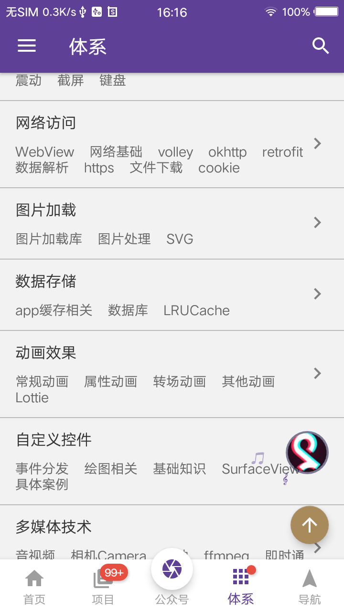
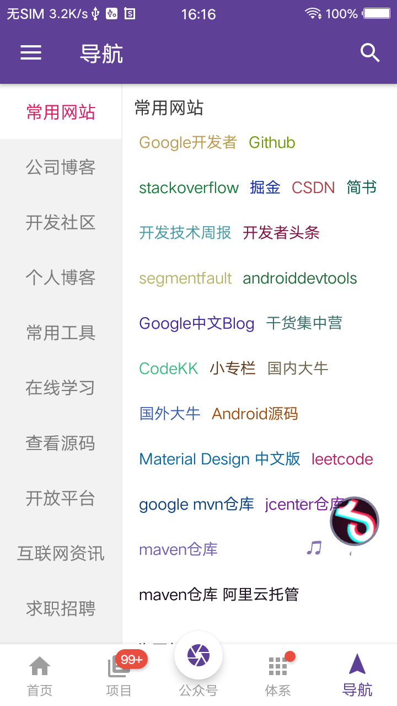
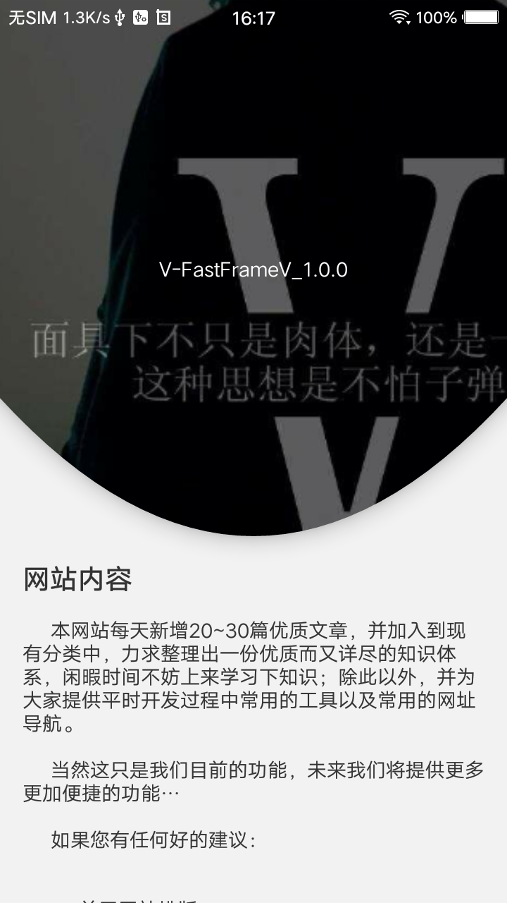
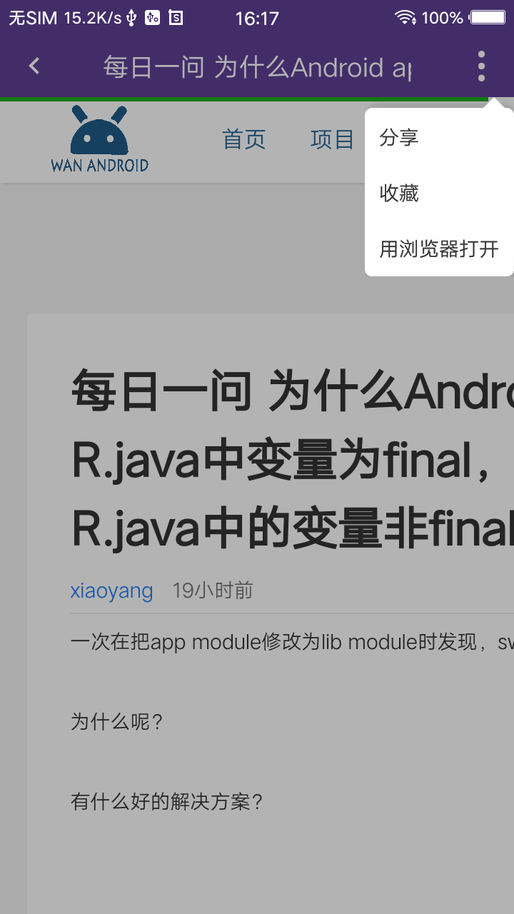
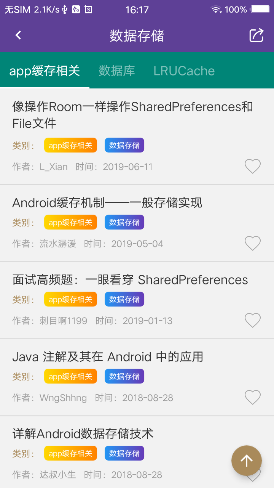

# V-FastFrame
无界编码，快捷构建，助你起飞
use Kotlin abd support androidX

<p align="center">
   <a href="#">
   [](https://www.apache.org/licenses/LICENSE-2.0)
  </a>
  <a href="https://travis-ci.org/JessYanCoding/MVPArms">
    
  </a>
  <a href="https://developer.android.com/about/versions/android-4.0.html">
    
  </a>
  <a href="http://www.apache.org/licenses/LICENSE-2.0">
    
  </a>
  <a href="https://www.jianshu.com/u/1d0c0bc634db">
    
  </a>
  <a href="https://shang.qq.com/wpa/qunwpa?idkey=7e59e59145e6c7c68932ace10f52790636451f01d1ecadb6a652b1df234df753">
    
  </a>
</p>

<p>
  <a href="#"></a>
  <a href="#"></a>
  <a href="#"></a>
</p>

[](https://android-arsenal.com/details/1/6001)
[](https://bintray.com/vension/vensionCenter/V-VisualizerView/_latestVersion)
[](https://android-arsenal.com/api?level=16)
[](https://img.shields.io/badge/Author-Vension-orange.svg?style=flat-square)

## Remark

个人快捷开发框架，采用Glide4.9+rxjava2+retrofit2+mvp的组件化开发模式，不断完善中。。。


## Screenshots
* fastframe
<a href="screenshots/fastframe_1.png"></a>
<a href="screenshots/fastframe_2.png"></a>

* wanAndroid
<a href="screenshots/wan/wan_1.png"></a>
<a href="screenshots/wan/wan_2.png"></a>
<a href="screenshots/wan/wan_3.png"></a>
<a href="screenshots/wan/wan_4.png"></a>
<a href="screenshots/wan/wan_5.png"></a>
<a href="screenshots/wan/wan_6.png"></a>
<a href="screenshots/wan/wan_7.png"></a>
<a href="screenshots/wan/wan_8.png"></a>

* 微课
<a href="screenshots/wk/one.png"></a> 
<a href="screenshots/wk/two.png"></a>
<a href="screenshots/wk/three.png"></a>
<a href="screenshots/wk/four.png"></a> 
<a href="screenshots/wk/five.png"></a>
<a href="screenshots/wk/.png"></a>
<a href="screenshots/wk/seven.png"></a> 


## License
```
 Copyright 2019, Vension

   Licensed under the Apache License, Version 2.0 (the "License");
   you may not use this file except in compliance with the License.
   You may obtain a copy of the License at

       http://www.apache.org/licenses/LICENSE-2.0

   Unless required by applicable law or agreed to in writing, software
   distributed under the License is distributed on an "AS IS" BASIS,
   WITHOUT WARRANTIES OR CONDITIONS OF ANY KIND, either express or implied.
   See the License for the specific language governing permissions and
   limitations under the License.
```
